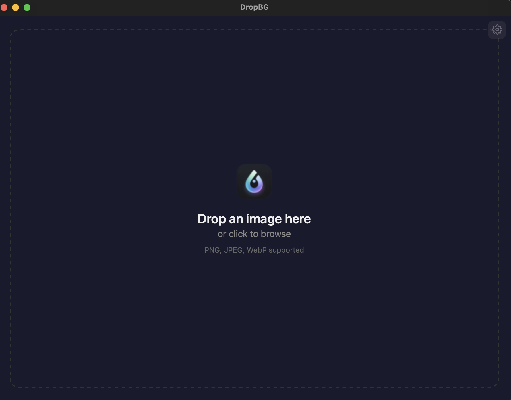

<p align="center">
  
</p>

<h1 align="center">DropBG</h1>

<p align="center">Local-first, privacy-friendly background remover for macOS.<br>No uploads, no subscriptions, no resolution limits.</p>

<p align="center">
  
</p>

## Why DropBG?

- **100% local** — images never leave your machine
- **Free & unlimited** — no per-image fees or resolution caps
- **Fast on Apple Silicon** — leverages CoreML / Neural Engine
- **One-time setup** — download the AI model once, then everything runs offline

## Features

- **Drag-and-drop** single or multiple images
- **5 AI models** to choose from (BiRefNet Lite/Full, BEN2, RMBG 2.0, MODNet)
- **Batch processing** with per-image progress and auto-naming
- **Background replacement** — solid colors, gradients, or custom images
- **AI upscaling** — 2x/4x super-resolution via Real-ESRGAN
- **Auto-crop** — trim transparent edges automatically
- **Before/after preview** — press Space to toggle
- **Configurable** — model location, save folder, model switching without restart

## Available Models

| Model | Size | Best For |
|-------|------|----------|
| BiRefNet Lite | ~200 MB | Fast, good for most images |
| BiRefNet Full | ~900 MB | Complex backgrounds, high detail |
| BEN2 | ~219 MB | Hair & fine edges, complex scenes |
| RMBG 2.0 | ~514 MB | Best overall quality (manual download) |
| MODNet | ~13 MB | Portraits & people (lightweight) |

## Tech Stack

| Layer | Choice | Why |
|-------|--------|-----|
| App | **Tauri 2** (Rust + React) | Lightweight, native feel |
| AI Inference | **ort** (ONNX Runtime) + CoreML EP | Apple Neural Engine acceleration |
| AI Upscale | **Real-ESRGAN x4plus** (ONNX) | High-quality super-resolution |
| Image | **image** crate + **ndarray** | PNG read/write with alpha channel |
| Frontend | **React 19** + TypeScript | Fast, component-based UI |

## Getting Started

> Prerequisites: [Rust toolchain](https://rustup.rs/), [Bun](https://bun.sh/)

```bash
# clone
git clone https://github.com/whereissam/DropBG && cd DropBG

# install frontend dependencies
bun install

# run in dev mode
cargo tauri dev
```

On first launch, DropBG asks you to download an AI model (~200 MB). After that, everything runs 100% offline.

### Installing from DMG (no code signing)

Since DropBG doesn't have an Apple Developer certificate yet, macOS will block the app on first launch:

1. Try to open DropBG — macOS shows a warning
2. Go to **System Settings → Privacy & Security**
3. Click **Open Anyway** next to the DropBG message
4. Or run: `xattr -cr /Applications/DropBG.app`

See [docs/USAGE.md](docs/USAGE.md) for detailed instructions.

## Build for Release

```bash
cargo tauri build
```

The DMG/app bundle will be in `src-tauri/target/release/bundle/`.

## Documentation

- [Usage Guide](docs/USAGE.md) — installation, features, models, troubleshooting
- [TODO / Roadmap](docs/TODO.md) — development phases and progress

## Project Structure

```
DropBG/
├── src-tauri/                # Rust backend
│   ├── src/
│   │   ├── lib.rs            # Tauri entry + command registration
│   │   ├── commands.rs       # IPC command handlers
│   │   ├── inference/        # ONNX Runtime session, pre/post processing, upscale
│   │   ├── imaging/          # Auto-crop, background replacement
│   │   └── model/            # Model downloader + config management
│   └── Cargo.toml
├── src/                      # React frontend
│   ├── App.tsx               # Main app (stage-based routing)
│   ├── tauri.ts              # Typed Tauri invoke wrappers
│   └── components/           # UI components
├── web/                      # Landing page (Astro)
├── docs/
│   ├── USAGE.md              # Usage guide
│   └── TODO.md               # Roadmap
└── README.md
```

## License

MIT
