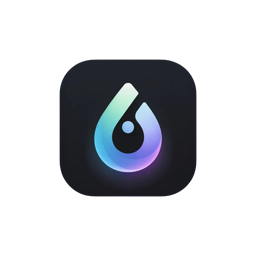

<p align="center">
  
</p>

<h1 align="center">DropBG</h1>

<p align="center">Local-first, privacy-friendly background remover for macOS. No uploads, no subscriptions, no resolution limits.</p>

Built with Tauri 2 + React + Rust, optimized for Apple Silicon via CoreML.

## Why DropBG?

- **100% local** — images never leave your machine
- **Free & unlimited** — no per-image fees or resolution caps
- **Fast on Apple Silicon** — leverages CoreML / Neural Engine
- **One-time setup** — download the AI model once, then everything runs offline

## Tech Stack

| Layer | Choice | Why |
|-------|--------|-----|
| App | **Tauri 2** (Rust backend + React frontend) | Lightweight, native feel, great drag-and-drop UX |
| AI Inference | **ort** (ONNX Runtime for Rust) + CoreML EP | Apple Neural Engine acceleration |
| Model | **BiRefNet Lite** (fp16 ONNX, ~200 MB) | Best quality/size tradeoff for background removal |
| Image Processing | **image** crate + **ndarray** | Read/write PNG with alpha channel |
| Frontend | **React 19** + TypeScript | Fast, component-based UI |

## Features

- Drag-and-drop or click to browse for images
- Real-time progress during AI inference
- Before/after preview with transparency checkerboard
- Configurable model download location
- Configurable default save location (auto-remembers last used folder)
- Settings panel for model management (download, delete, relocate)
- Toast notifications with actions

## Getting Started

> Prerequisites: Rust toolchain, [Bun](https://bun.sh/)

```bash
# clone
git clone <repo-url> && cd DropBG

# install frontend dependencies
bun install

# run in dev mode
cargo tauri dev
```

On first launch, DropBG will ask you to download the AI model (~200 MB). After that, everything runs 100% offline.

## Project Structure

```
DropBG/
├── src-tauri/                # Rust backend
│   ├── src/
│   │   ├── lib.rs            # Tauri entry + command registration
│   │   ├── commands.rs       # IPC command handlers
│   │   ├── inference/        # ONNX Runtime session, pre/post processing
│   │   ├── imaging/          # Image manipulation (autocrop, background)
│   │   └── model/            # Model downloader + config management
│   └── Cargo.toml
├── src/                      # React frontend
│   ├── App.tsx               # Main app (stage-based routing)
│   ├── tauri.ts              # Typed Tauri invoke wrappers
│   ├── components/
│   │   ├── ModelSetup.tsx    # First-launch download consent screen
│   │   ├── DropZone.tsx      # Drag-and-drop area
│   │   ├── Preview.tsx       # Before/after image preview
│   │   ├── Toolbar.tsx       # Save / New Image actions
│   │   ├── Settings.tsx      # Model & output settings panel
│   │   └── Toast.tsx         # Toast notifications
│   └── assets/               # Logo and static assets
├── docs/TODO.md
└── README.md
```

## License

MIT
